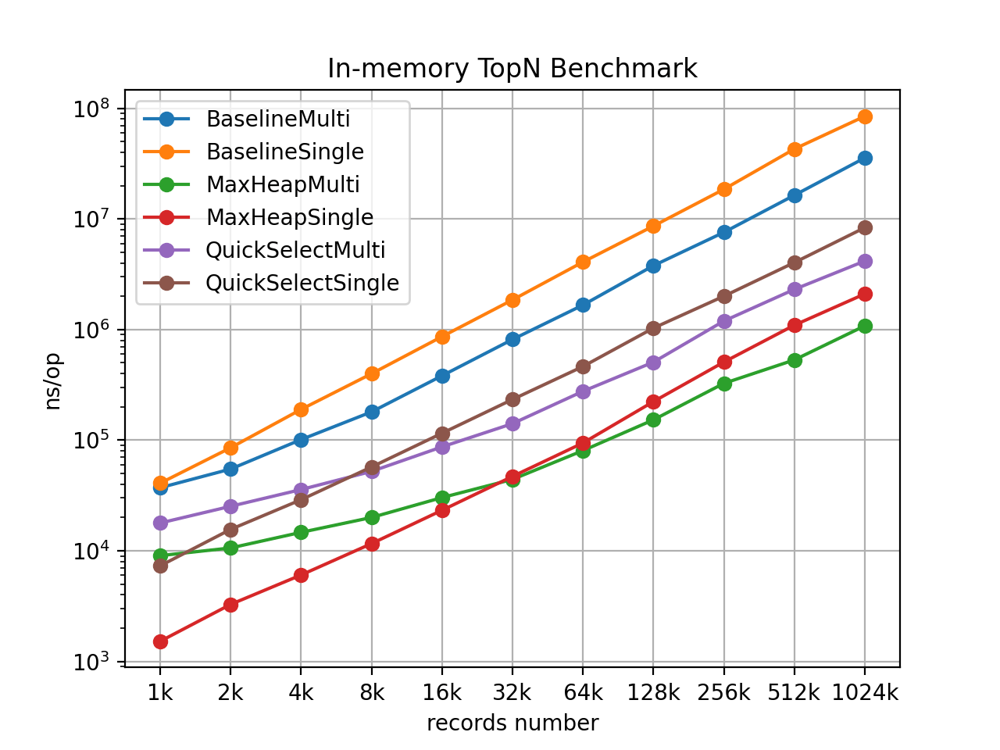

# pingcap 面试小作业

## 原题
原题如下

> 内存中的行列结构的数据集，存在主键 k，求 TopN 算法
> 
> 上述题目在多核环境下的优化
> 
> 数据集大小为 1TB，分布规律未知。存储在某存储服务上，以 get(min_k, max_k) 接口获取数据，求多台服务器的计算方案


## 题目理解

首先尝试形式化定义原题，确保在实现前与题目原义对齐。这里使用 golang 作为实现语言。

### 约定

内存中的行列数据结构以行为数据记录单元，可以使用键值对的形式表示，其中 key 为主键，data 为该行数据。由于需要求 TopN，因此所有行的集合形成一个*全序集*。暂且不考虑行数据的具体存储编码，将逻辑结构定义为

```go
type Record struct {
	Key   int    // 主键，排序字段
	Data  []byte // 数据
}
```

### 题目形式化定义

在以上约定的前提下，这里尝试将原题定义得更形式化，便于消除歧义。

#### 题目
内存中有数据集 `records []Record`，两个 `Record` `R1` 和 `R2` 的排序等价于 `rank` 字段的排序，即 `R1 > R2` 当且仅当 `R1.key > R2.key`，每个 record 的主键唯一。基于以上定义，完成下列三道题目：
1. 设计单核情况下，查询 `records` 中最小的 `N` 个值的 TopN 算法。
2. 在多核情况下，优化 1 中的算法。
3. 考虑分布式情况：数据集大小为 1TB，主键顺序随机，存储在存储服务 `Store` 上。用户以 `get(n, min_k, max_k)` 接口获取主键范围在 `[min_k, max_k]` 内的 TopN 数据，求多台计算节点、一个存储服务、一个请求服务的计算方案。


## 解答

### 1. 单核
单核情况下，实现了三种算法解答：quickSort 全排序、quickSelect 选择第 N 个 key、最大堆。

- 基于 quickSort 的全排序主要作用是作为一个 baseline，排序后直接取 TopN，作为性能和正确性对比的参照物，时间复杂度为 O(nlog(n))，n 为所有 key 的个数。
- quickSelect 在 quickSort 的基础上，修改了选取 pivot 后的逻辑，只继续递归包含第 N 个元素的一端，因此整体算法复杂度降低为 O(n)，n 为所有 key 的个数。需要注意，该算法返回的 topN 是不保证有序的。
- 基于最大堆的 topN 算法，依赖一个最大堆的实现，即堆顶为堆中最大元素。先用前 topN 个 key 建堆，然后遍历所有 key，小于堆顶时替换堆顶 key，并维护堆的 invariants：父节点大于子节点，最终堆内即为 topN 的 key。算法复杂度为 O(nlog(N))，n 为所有 key 的个数，N 为 topN 个数。

以上实现代码主要在 `pkg/local/single_core.go` 中。

### 2. 多核
多核情况下，可以利用 goroutine 调度多核进行并行计算，提升算法执行速度。算法并行化的基本思路是，把数据拆分成互不相交的段，分给多个 goroutine 分别计算每段的 topN，再把所有分段结果汇总求 topN。因此，多核情况下需要额外实现的逻辑，主要是：

1. 数据分段
2. 调度和汇总 goroutine 分段计算结果

以上实现代码主要在 `pkg/local/multi_core.go` 中。

### 3. 分布式
分布式情况下，采用了 map-reduce 的计算模式，整个系统中包含三个主要组件：分布式存储、计算节点 mapper、计算调度器 master。对于本项目而言，分布式存储的实现并不影响设计，因为一般其暴露给应用层的 API 与传统文件系统类似，因此为了简化实现难度，使用了共享文件存储卷的方式在 mapper 和 master 之间共享数据，测试时利用在多个 docker container 之间挂载同一个 host volume 的方式实现。

同时，文件按照固定大小拆分成 block，为了简化细节，保证每个 record 数据不会跨文件 block，block 末尾不足的字节用 0 字节 pad。在生成数据文件 block 的同时，生成对应的 meta 文件，存放每个 record 数据的长度，简化数据文件编码方式。事实上这种结构在 hadoop 中也存在，即将数据分别存放在 data 和 metadata 分别存放，便于管理。

在此架构下，题目要求的分布式 topN 计算流程描述如下：

1. master 接收调用请求，生成在文件 block 上计算 key 在 [minKey, maxKey] 范围内 topN 的任务队列
2. master rpc 调用连接到的 mapper 节点，等待执行队列中的计算任务
3. 如果步骤 2 计算任务失败，将当前任务重新加入任务队列进行重试
4. 如果步骤 2 计算任务成功，master 将 block 中 topN 结果保存到结果队列
5. master 等待任务队列为空时，本地计算结果队列中的 topN，并返回结果

本项目使用 gRPC 框架实现步骤 2 中描述的 rpc。

## 测试

### 1. 单机情况
单核与多核情况下，数据存在于内存，只涉及单机，因此在 `pkg/local` 中构建了单元测试和性能测试，对实现进行测试。

#### 运行
在项目根目录执行以下命令，运行单元测试和性能测试
```bash
go test -v -bench=. -count=1 github.com/dragonly/pingcap_interview/pkg/local
```

#### 性能测试结果
固定 topN 数量为 N=10，让 record 数量从 1000 开始，以乘以 2 的方式指数增长到 1024000，分别测试单核与多核版本算法性能，并使用 `benchmark_local.py` 脚本画图，得到 `benchmark_local.png` 所示的折线图。



图中以 Single 结尾的折线代表单核算法，以 Multi 结尾的代表多核算法。可以看出在当前实现下，效果最好的是基于最大堆的算法，并且在 record 数量大于 32000 之后，多核带来的 overhead 才逐渐被并行带来的加速抵消掉，显示出多核性能优势。由于时间关系和对 golang 的熟悉程度限制，本项目没有对多核情况进行更加深入的优化。

### 2. 分布式情况
分布式情况的集成测试环境使用 `docker-compose.yaml` 进行封装，统一测试环境，使测试过程更容易复现。

#### 数据生成
数据生成的参数配置在 `config.yaml` 里面的 `cluster.data` 段，具体字段含义见配置文件注释。

编辑配置文件后，执行 `go run main.go gen` 即可生成 key 顺序随机的 records 文件 block。默认配置会生成 2048 个 512MB 大小的文件 block，总共大小为 1TB。

#### 集成测试
生成数据后，即可进行集成测试。集成测试环境由 `docker-compose.yaml` 文件定义，执行 `docker-compose up --build` 命令即可启动集成测试环境。

集成测试中，定义了 3 个 mapper 节点和一个 master 节点，master 启动查询命令后，会连接到 3 个 mapper 节点，并使用 dispatcher/worker 模式新建对应的 goroutine 把具体任务调度给空闲的 worker goroutine，后者会使用 gRPC client 调度 mapper 执行计算任务，等待结果，并返回给 dispatcher，最终在 master 端执行 reduce 操作获取最终 topN 数据。
